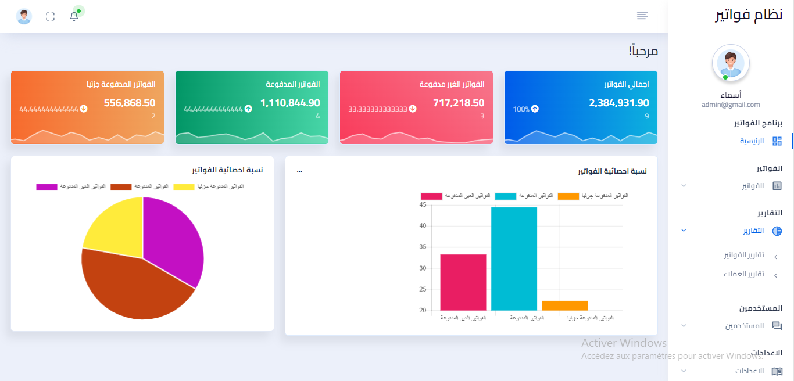
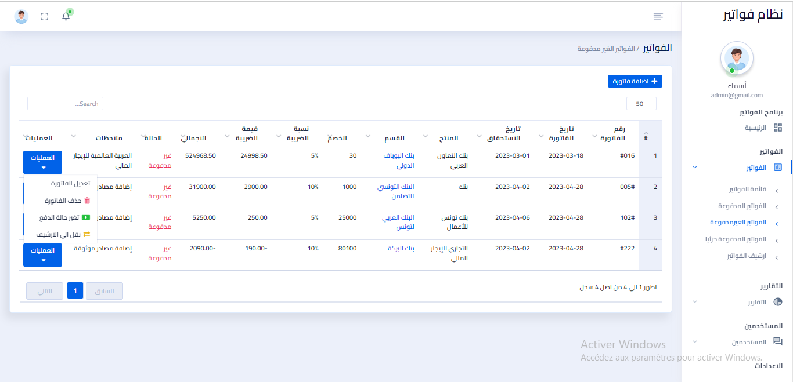

# Project Setup Guide
After one month of self-learning, I was able to build an admin dashboard for debt companies system that is responsible for collecting debt for the banks using “Laravel” as a framework.
The Dashboard supports Arabic language only, and can do the following services:
• View statistics for total bills.
• “Invoices” section:  this section can view, add, edit, archive, print, or change the status of payment for paid, unpaid and partially paid invoices.
• “Sections” section: this section can view, add, edit, or delete a bank.
• “Products” section: this section can view, add, edit, or delete a service from the services that the banks can provide.
• “Reports” section: this section can search for type or number of specific invoice, a specific date or a specific section.
• “Roles and Permissions” section: this section can add many types of users with specific permissions; view or edit those permissions with the ability of change the status of the users from “Active” to “Inactive”. 
• “Notifications” section: this section show the notifications of the invoices that has been added recently.
## Overview
An MQTT Client built with [Laravel](https://laravel.com/), providing a set of features:


- A full-featured login system (login, register, email verification, profile update, and password reset).
- The ability to create, manage and use multiple connections to different brokers (public/private).
- The ability to subscribe and manage different topics on each connection with real-time updates.
- Logs that display all the received payloads and the ability to search, filter, and delete them.


<br>

<br>

<br>

<br>




## Manual Setup
Before setting up the project, make sure you have the required dependencies:
- **PHP >= 8.0**
- **composer**
- **npm**
- **MySQL**
- **MailHog**
- **Excel**

### Setting the project
Make sure you are in the `src` directory
```bash
cd src/
```

Install composer dependencies
```bash
composer install
```

Install npm dependencies and build the assets
```bash
npm install
npm run build
```

Create the `.env` file and generate the application encryption key
```bash
cp .env.example .env
php artisan key:generate
```

Update the `.env` file with your `mysql` credentials and `MailHog` host
```bash
DB_CONNECTION=mysql
DB_HOST=127.0.0.1 # old value: mysql
DB_PORT=3306
DB_DATABASE=# your database
DB_USERNAME=# your username
DB_PASSWORD=# your password

MAIL_HOST=127.0.0.1 # old value: mailhog
```

Update the `package.json` file by swapping the `scripts` section with the one below
```json
"scripts": {
    "dev": "vite",
    "build": "vite build"
},
```

Create the database schema and its tables by running the migrations
```bash
php artisan migrate
```

### Running the project

Start MySQL server
```
sudo systemctl start mysql
```

Start MailHog
```
~/go/bin/MailHog
```

Start the built-in web server
```bash
php artisan serve
```

You can now access the server at [http://localhost:8000](http://localhost:8000).
