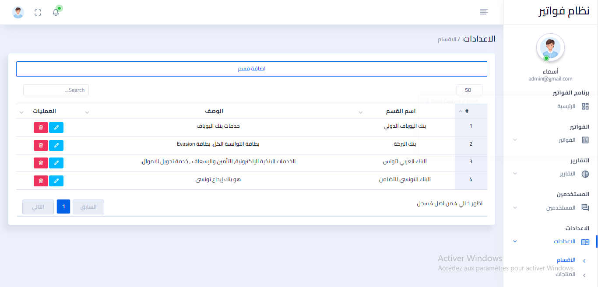
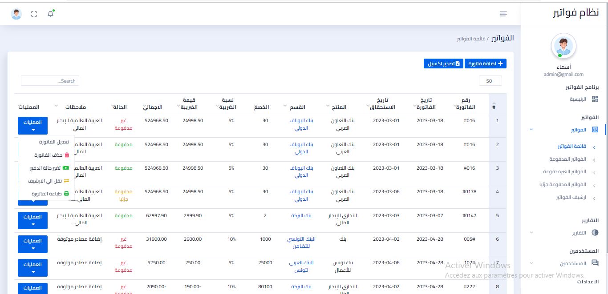
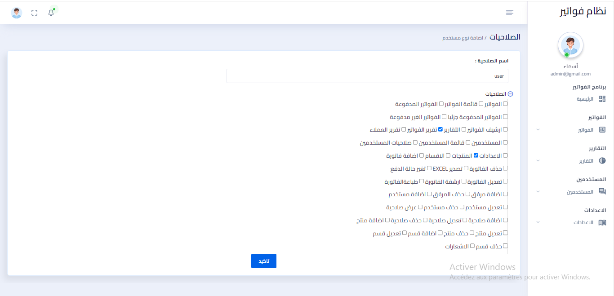

# Project Setup Guide

## Overview
A management dashboard for a debt collection company for banks using [Laravel](https://laravel.com/) as a framework.

The dashboard only supports the Arabic language, providing a set of features:

- View statistics for total invoices.
<br>
- Section "Invoices": this section allows you to view, add, edit, archive, print, or change the payment status of paid, unpaid, and partially paid invoices.
<br>
- Section " Sections ": this section allows you to view, add, modify, or delete a bank.
- Products" section: this section allows you to view, add, modify, or delete a service among the services that the banks can offer.
- Section "Reports": this section can search for the type or number of specific invoices, a specific date, or a specific section.
- Section "Roles and Permissions": this section can add many types of users with specific permissions; display or modify these permissions with the ability to change the status of users from "Active" to "Inactive".
- Notifications section: this section displays notifications of invoices that have been added recently.


<br>

<br>

<br><br>

<br><br>

<br><br>




## Manual Setup
Before setting up the project, make sure you have the required dependencies:
- **PHP >= 8.0**
- **composer**
- **npm**
- **MySQL**
- **MailHog**
- **Excel**
- **Free Template**

### Setting the project
Make sure you are in the `src` directory
```bash
cd src/
```

Install composer dependencies
```bash
composer install
```

Install npm dependencies and build the assets
```bash
npm install
npm run build
```

Create the `.env` file and generate the application encryption key
```bash
cp .env.example .env
php artisan key:generate
```

Update the `.env` file with your `mysql` credentials and `MailHog` host
```bash
DB_CONNECTION=mysql
DB_HOST=127.0.0.1 # old value: mysql
DB_PORT=3306
DB_DATABASE=# your database
DB_USERNAME=# your username
DB_PASSWORD=# your password

MAIL_HOST=127.0.0.1 # old value: mailhog
```

Install maatwebsite/excel package.
 You can install Laravel Excel via composer.
```bash
composer require maatwebsite/excel
```
You can have the following code placed inside the config/app.php file.
```bash
'providers' => [
  Maatwebsite\Excel\ExcelServiceProvider::class,
 ],  

'aliases' => [ 
  'Excel' => Maatwebsite\Excel\Facades\Excel::class,
], 
```
Execute the vendor, publish the command, and publish the config.
```bash
php artisan vendor:publish --provider="Maatwebsite\Excel\ExcelServiceProvider" --tag=config
```
This will create a new config file named config/excel.php.


Create the database schema and its tables by running the migrations
```bash
php artisan migrate
```

### Running the project

Start MySQL server
```

Start MailHog
```

Start the built-in web server
```bash
php artisan serve
```

You can now access the server at [http://localhost:8000](http://localhost:8000).
